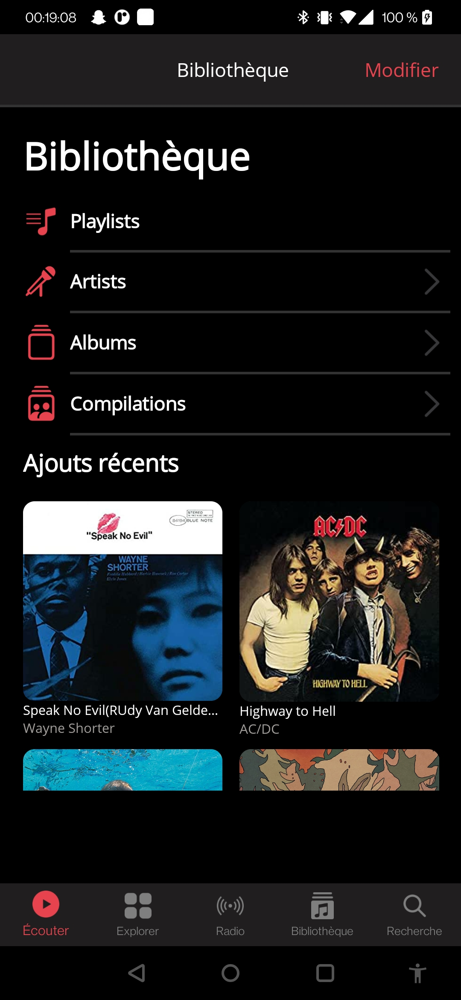
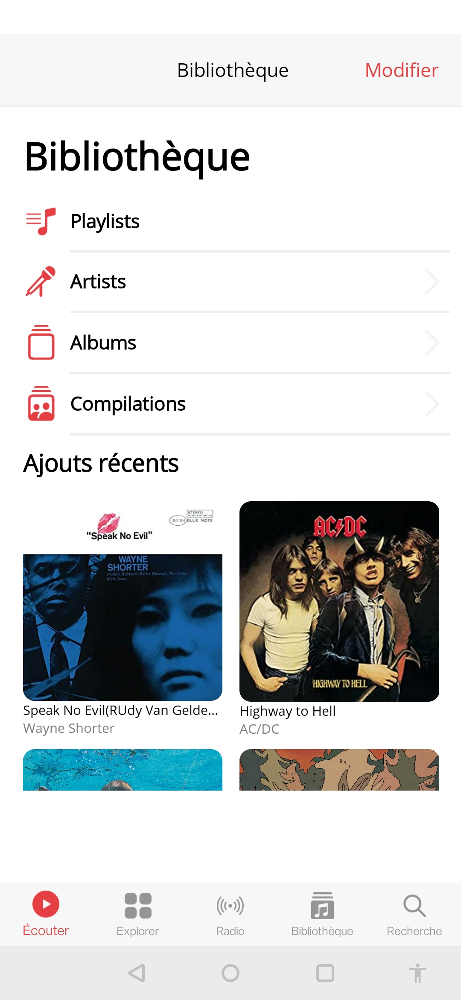
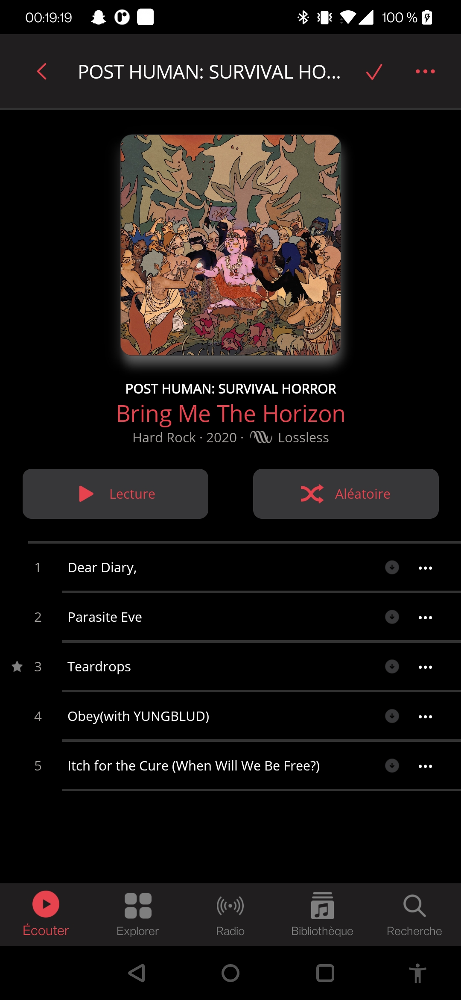
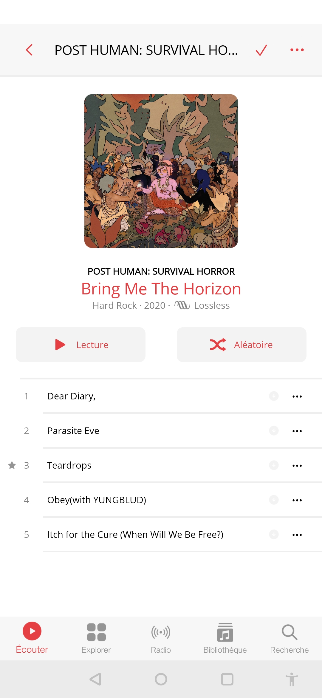
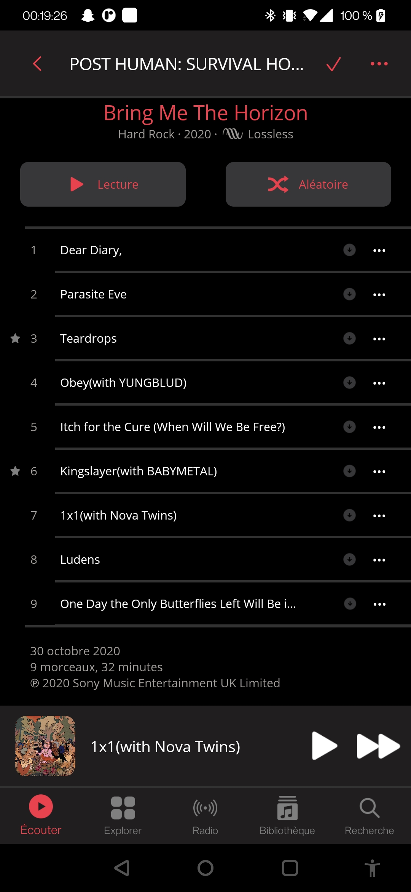
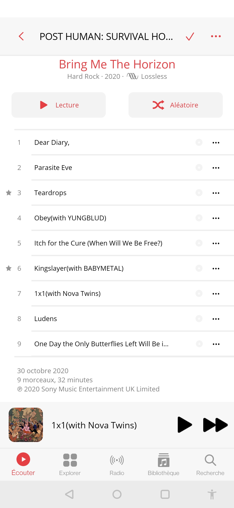
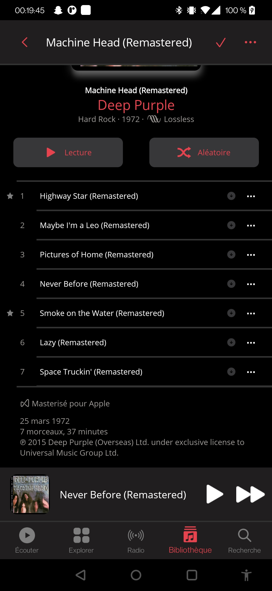
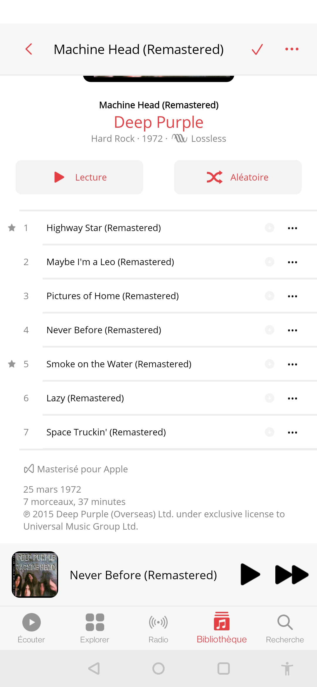

# AppleMusic
# Overview
This project is a simple example of MAUI application that try to reproduce the Apple Music UI.
We only have the library page and album page with a simple navigation between them.

# Screenshots


<br/>


<br/>


<br/>



# Features
- [x] Android
- [ ] iOS (MAUI Toolkit no work => XCode not updated)
- [x] Navigation
- [X] Pages
- [X] Custom Views
- [X] Styles and Colors
- [X] Dark / Light Theme
- [X] Bindings
- [X] MAUI Toolkit
- [X] Interactive Playing View
- [ ] Updateable Navigation Bar (background and text)
- [ ] Blur effect Navigation Bar, Tab Bar and Playing View

# Getting Started
## Prerequisites
- Visual Studio 2022 Windows or Mac
- .NET 7.0 SDK
- Android Emulator or Android Device

## Installation
1. Clone the repo
   ```sh
   git clone
    ```
2. Open the solution with Visual Studio 2022
3. Run the project

# Authors
[](https://github.com/iShoFen)
[](https://www.linkedin.com/in/samuel-sirven-b49b53211/)